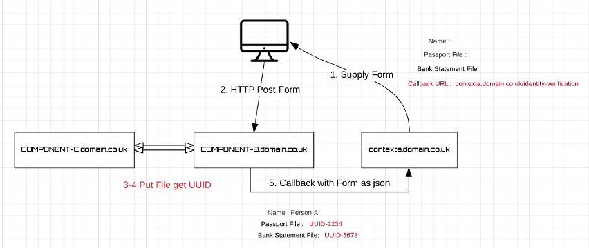
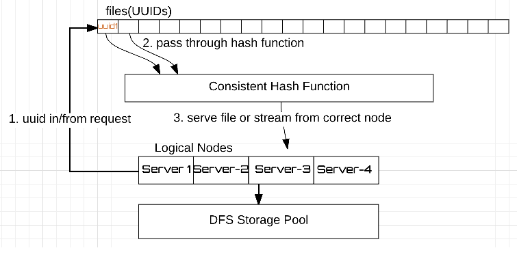

# File Service
A file service with a HTTP/S API

## Status
Work in Progress

## Storage

Create UUID, pass it through the consistent hash and store file in directory, return UUID in response.

### Retrieval

Get UUID, pass it through the consistent hash, get directory, return file in response.


### Security

Apply firewalls and authentication/authorisation to secure various zones and expose only required API calls.

## HTTP/S API


### PUT File 

URL: /put

Put an object to the file store.

This operation returns a token (UUID).

The file is stored as blob with UUID as name

** Recommended flow from a client perspective **
<ol>
    <li>PUT file, returns UUID</li>
    <li>GET file hash, check hash is as expected </li>
</ol>

### Testing PUT

**Use HTTPS, the below is a sample only**

#### File Transfer

HTTP PUT to transfer the file

curl -v http://localhost:8080/file-service/put --upload-file file-service.png

TRACE of operation

```curl
> PUT /file-service/put HTTP/1.1
> Host: localhost:8080
> User-Agent: curl/7.48.0
> Accept: */*
> Content-Length: 60660
> Expect: 100-continue
>
< HTTP/1.1 100 Continue
< Content-Length: 0
* We are completely uploaded and fine
< HTTP/1.1 200 OK
< Connection: keep-alive
< Content-Length: 36
< Date: Fri, 11 Nov 2016 15:33:10 GMT
<
3040c7b6-0c6d-4582-8ff9-d8fa31ea2d8b
```

3040c7b6-0c6d-4582-8ff9-d8fa31ea2d8b is the UUID used to retrieve the file

### PUT File and encrypt 

** Consider maybe using an encrypted file system and use the plain /put **

URL: /put/encrypt

Put an object to the file store and encrypt on disk.

This operation returns a token (UUID).

The file is stored as an encrypted blob with UUID as name

### POST Form

Posting a multi-part form to the file store.

Component-B options.

<ul>
    <li>Standalone</li>
    <li>Co-locate on context-a ( callback URL not required in Forms )</li>
    <li>Co-locate on component-c</li>
</ul>




### POST keywords

Post keywords about an object in the file store.

This operation requires a token (UUID).

The keywords will be indexed and used for file search/retrieval.

### GET File

URL: /get/{UUID}

Get an object from the file store using the token (UUID)


### GET File Hash

URL: /get/hash-sha-256/{UUID}

Get the SHA-256 hex hash of an object from the file store using the token (UUID)


### SEARCH File

Return the tokens (UUIDs) of files that satisfy the search criteria.


## Mandatory Request Headers

| Header Name        | Example       | Description  |
| ------------------ |:-------------:| -----:|
| Content-Length     | 1200          | All requests include a valid Content-Length header |
| Content-Type       | text/html     | See supported Content Types section |
...
Access control headers

## Metadata JSON fields

Metadata is stored as JSON and key fields include

| Field Name         | Example                 | Description  |
| ------------------ |:-----------------------:| -----:|
| Content-Type       | application/msword      | The content type from the headers |
| Content-Length     | 1200                    | The content type from the headers | 
| File-Name          | witnessstatements.doc  | The actual file name |


## Supported Content Types

| Content-Types      | File Type |
| ------------------ |-----------| 
| text/html          | html |
| text/css           | css  |
| text/javascript    | js   |
| text/xml           | xml  |
| image/jpeg         | jpg  |
| image/png          | png  | 
...


## Constraints

| Constraint                       |                                          |
| -------------------------------- |----------------------------------------- | 
| Maximum number of files in dir   | 2 pow 64 (decided by storage pool max)   |
| Maximum number of directories    | 2 pow 64 (decided by storage pool max)   |


## Benchmarks

| File-Sizes      | Throughput |
| ----------------|----------- | 
| 1KB             |            |
| 10KB            |            |
| 100KB           |            |
| 1MB             |            |
| 10MB            |            |
| 100MB           |            |
| 1GB             |            |
| 10GB            |            |


## Setup
1. Create DFS Storage Pool
2. Create fixed number of directories in storage pool, suffixed by number, following a pattern
   Example: dir-0, dir-1 dir-2....

## Important

** The directory names should end with the pattern 0, 1, 2 ... **

** The directory structure is considered frozen once in use **

** The number of directories once in use cannot be changed without "Migration" **

## Clustering

This follows the same pattern as the directories and the number of nodes in the cluster are fixed. 
So consistent hash can work correctly.

So for example a cluster comprised of 3 nodes could follow the pattern 
fileserver-0.domain.co.uk, fileserver-1.domain.co.uk, fileserver-2.domain.co.uk.



Each node also has a locking mechanism to serialise access to a specific file (UUID). 
 
So routing to a specific node is required to make use of this locking mechanism, achieving  a cluster wide lock on any file UUID. 

### Stickiness of UUIDs

* Each node receives the request (create/update/get/..)
* Runs the file UUID through the consistent hash
* Then
    * If it owns the UUID, completes the request
    * If it does not, requests the operation from the owning node and returns the response. 


## Migration

1. Create a bigger storage pool cluster
2. Push files from one pool to other using the same process flow.

## Replication

Geo distributed DFS

## Backup

Backup DFS
