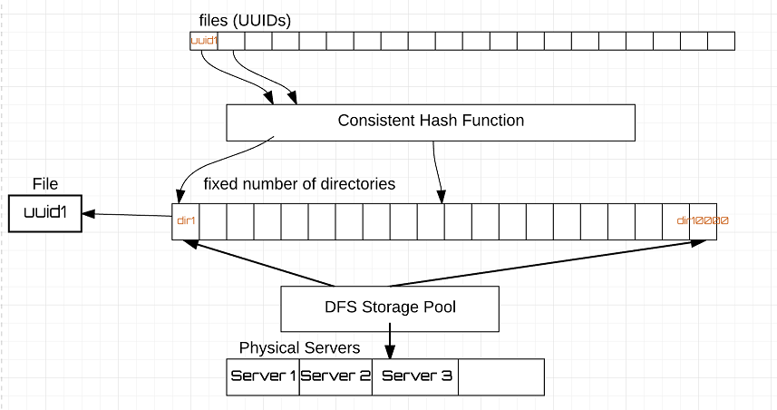

# File Service
A file service with a REST API

## Status
Work in Progress

## Storage

Create UUID, pass it through the consistent hash and store file in directory, return UUID in response.

### Retrieval

Get UUID, pass it through the consistent hash, get directory, return file in response.

## REST API

### PUT File

Put an object to the file store.

This operation returns a token (UUID).

### GET File

Get an object from the file store using the token (UUID)

### DELETE File

Delete an object in the file store using the token (UUID)

### POST keywords

Post keywords about an object in the file store.

This operation requires a token (UUID).

The keywords will be indexed and used for file search/retrieval.

### SEARCH File

Return the tokens (UUIDs) of files that satisfy the search criteria.

## Mandatory Request Headers

| Header Name        | Example       | Description  |
| ------------------ |:-------------:| -----:|
| Content-Length     | 1200          | All requests include a valid Content-Length header |
| Content-Type       | text/html     | See supported Content Types section |

## Supported Content Types

| Content-Types      | File Type |
| ------------------ |-----------| 
| text/html          | html |
| text/css           | css  |
| text/javascript    | js   |
| text/xml           | xml  |
| image/jpeg         | jpg  |
| image/png          | png  | 
...

## Constraints

| Constraint                       |                                          |
| -------------------------------- |----------------------------------------- | 
| Maximum number of files in dir   | 2 pow 64 (decided by storage pool max)   |
| Maximum number of directories    | 2 pow 64 (decided by storage pool max)   |

## Benchmarks

| File-Sizes      | Throughput |
| ----------------|----------- | 
| 1KB             |            |
| 10KB            |            |
| 100KB           |            |
| 1MB             |            |
| 10MB            |            |
| 100MB           |            |

## Setup
1. Create DFS Storage Pool
2. Create fixed number of directories in storage pool, suffixed by number, following a pattern
   Example: dir-1, dir-2 dir-3....

## Migration

1. Create a bigger storage pool cluster
2. Push files from one pool to other using the same process flow.

